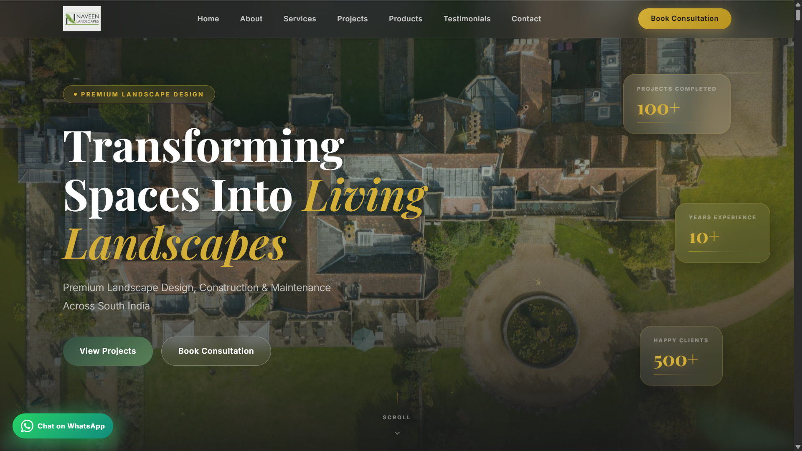
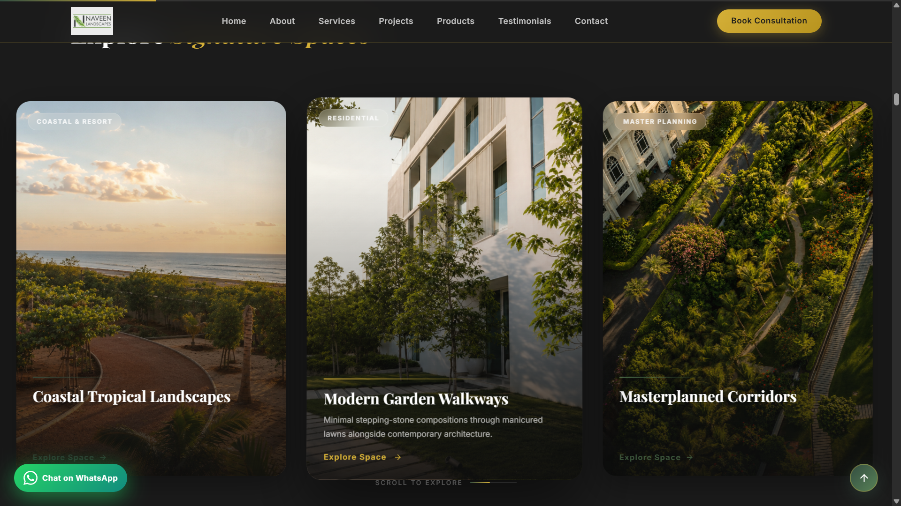
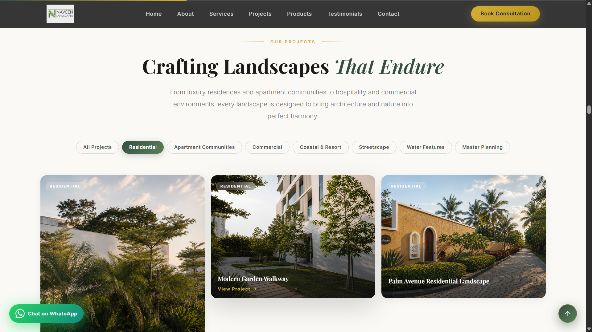
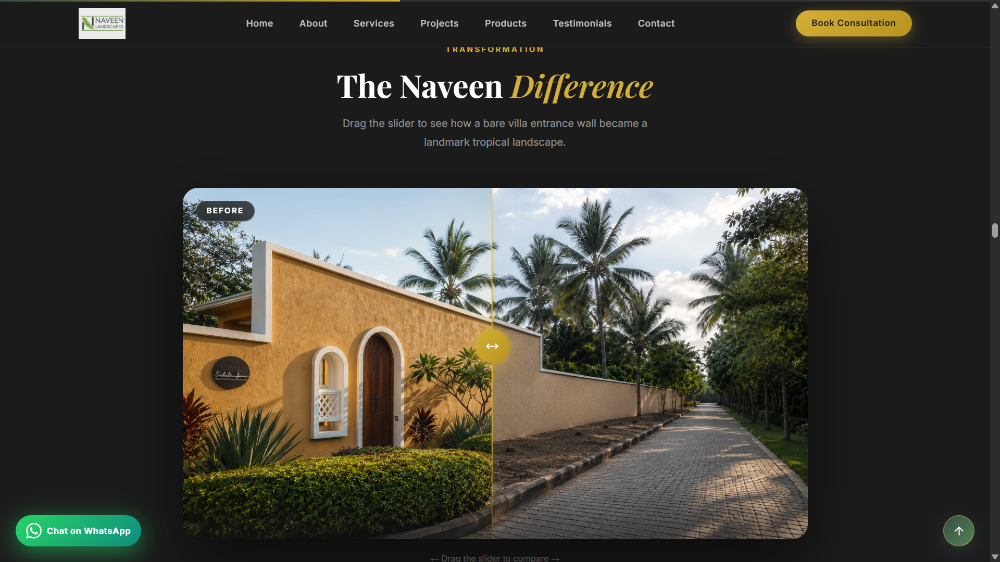
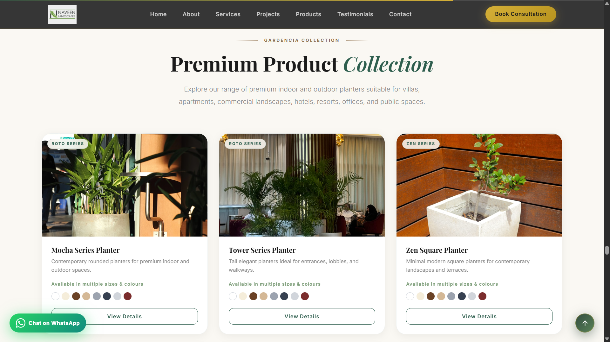
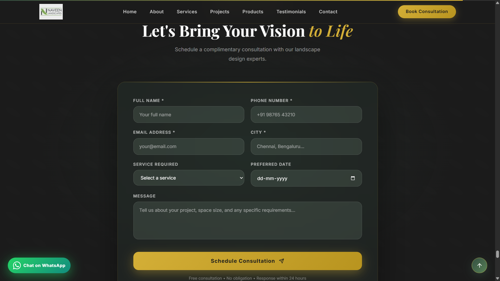
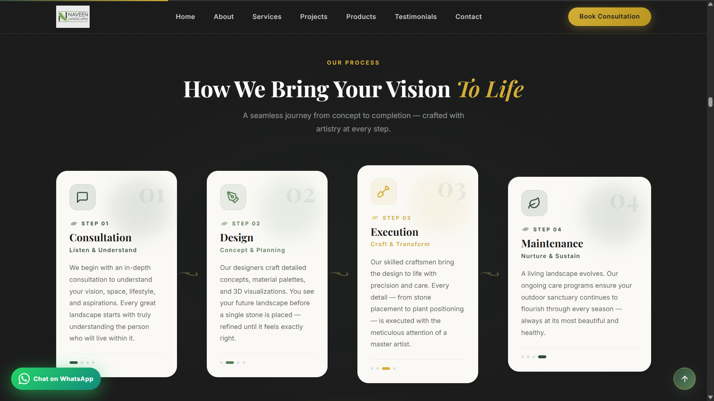

<div align="center">

# Naveen Landscapes
### Premium Luxury Landscaping Website

A modern, fully responsive business website designed and developed for **Naveen Landscapes**, a premium landscape architecture company serving South India.

Built with modern web technologies, premium UI design, responsive layouts, dynamic product showcase, consultation booking, email automation, and database integration.

### Live Website

https://www.naveenlandscapes.com

---



</div>

---

# Project Overview

This project was developed as a complete production-ready website for a real landscaping company.

The objective was to create a premium digital experience that reflects the luxury branding of the company while making it easy for customers to:

- Explore completed projects
- Browse landscaping services
- View premium planter collections
- Submit consultation requests
- Send product enquiries
- Subscribe to newsletters
- Contact the company

The website combines modern frontend design with cloud backend services for seamless lead generation.

---

# Features

## Premium UI/UX

- Luxury dark & light themed interface
- Responsive design
- Smooth animations
- Interactive components
- Modern typography
- High-quality image galleries

---

## Interactive Sections

- Hero Landing Page
- About Company
- Services Showcase
- Project Portfolio
- Before / After Comparison Slider
- Premium Product Catalogue
- Consultation Form
- Testimonials
- Contact Section
- Newsletter Subscription

---

## Backend Features

- Consultation Form
- Product Enquiry Form
- Newsletter Subscription
- Email Notifications
- Cloud Database Storage
- Spam Protection
- Production Deployment

---

# Tech Stack

| Category | Technologies |
|-----------|-------------|
| Frontend | React, TypeScript, Vite |
| Styling | Tailwind CSS |
| Backend | Vercel Serverless Functions |
| Database | Supabase |
| Email Service | Resend |
| Hosting | Vercel |
| DNS | GoDaddy |
| Business Email | Google Workspace |

---

# Screenshots

## Landing Page


---

## Services



---

## Projects



---

## Before & After Comparison



---

## Premium Product Collection



---

## Consultation Booking



---

## Process



---

# Project Highlights

- Fully responsive
- Production deployed
- Business email integration
- Custom domain
- Newsletter automation
- Product enquiry workflow
- Consultation booking workflow
- Cloud database
- Premium UI
- Modern animations
- Mobile optimized

---

# Folder Structure

```
src/
components/
hooks/
pages/
public/
api/
assets/
```

---

# Installation

Clone the repository

```bash
git clone https://github.com/Oreki1107/Naveen-landscapes.git
```

Install dependencies

```bash
npm install
```

Run locally

```bash
npm run dev
```

---

# Environment Variables

Create a `.env.local`

```env
RESEND_API_KEY=
SUPABASE_URL=
SUPABASE_ANON_KEY=
TO_EMAIL=
```

---

# Live Demo

https://www.naveenlandscapes.com

---

# Author

**Mohan Krishnan S**

AI & Data Science Undergraduate

Full Stack Web Developer

GitHub

https://github.com/Oreki1107

---

## License

This repository is shared for portfolio purposes.

Project assets, branding, photographs, and business content belong to **Naveen Landscapes**.

The source code is available for educational and portfolio viewing only.
